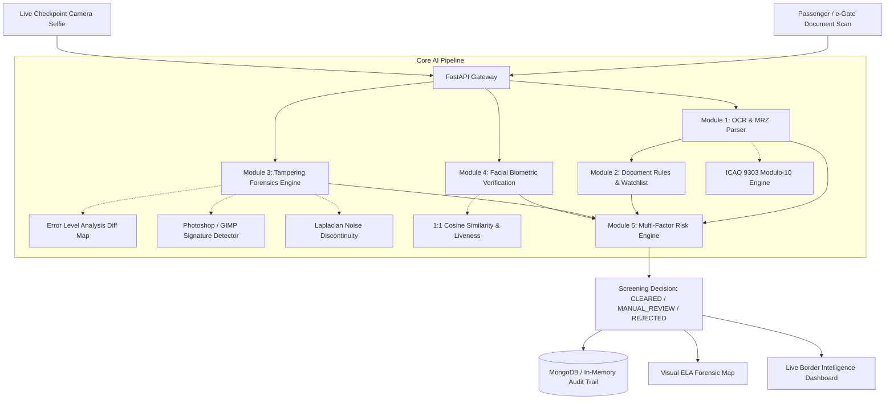

# 🛡️ BorderGuard AI: Fake Identity & Document Screening System

> **High-Throughput AI Screening & Digital Forensics Backend for Border Checkpoints, e-Gates, and Immigration Control**

[](https://python.org)
[](https://fastapi.tiangolo.com)
[](https://mongodb.com)
[](LICENSE)

---

## 📌 Problem Statement & Overview

Border checkpoints process thousands of identity documents daily (passports, visas, national ID cards, driving licenses). Manual verification is slow, prone to human fatigue, and vulnerable to sophisticated modern threats:
- **Altered photographs & photo splicing**
- **Modified birthdates and expiration dates**
- **Forged or tampered visa stamps**
- **Identity impersonation (document holder ≠ presenter)**
- **Stolen documents and blacklisted individuals**

**BorderGuard AI** solves this by delivering an end-to-end automated screening pipeline that parses documents, verifies ICAO 9303 checksums, performs Error Level Analysis (ELA) forensics, compares live facial biometrics, and computes a multi-factor risk score in **under 250 milliseconds**.

---

## 🏛️ System Architecture



---

## ⚡ Core Innovations & Modules

### 1. Module 1: OCR & ICAO 9303 MRZ Engine
- Automatically extracts structured fields: Name, Document Number, Nationality, DOB, Expiry, Gender.
- Full mathematical implementation of **ICAO Doc 9303** weighted modulo-10 algorithm ($7, 3, 1, 7, 3, 1 \dots$) across **TD1** (ID Cards), **TD2**, and **TD3** (Passports).
- Hybrid zero-shot multimodal vision fallback (Gemini Vision) for unstandardized IDs.

### 2. Module 2: Document Validation & Watchlists
- **Date Rules**: Audits document expiration, 6-month validity threshold, and age sanity.
- **Cross-Zone Verification**: Detects discrepancies between visual zone text and MRZ zone.
- **Interpol / Blacklist Matching**: Real-time probe against stolen document and terrorist databases.

### 3. Module 3: Tampering Detection (Core AI Innovation)
- **Error Level Analysis (ELA)**: Recompresses image at known quality and computes localized error differences. Substituted photos or modified digits glow brightly in the generated heatmap.
- **Metadata Forensics**: Flags software traces from Adobe Photoshop, GIMP, Canva, and Photopea.
- **Boundary & Splice Discontinuity**: Compares Laplacian noise variance between portrait region and document substrate.

### 4. Module 4: Facial Biometrics & Anti-Spoofing
- Automatically crops portrait photo from identity document.
- Detects face from live checkpoint camera feed.
- Computes $1:1$ Biometric Cosine Similarity and texture anti-spoofing score.

### 5. Module 5: Explainable Risk Scoring Engine
$$\text{Risk Score} = 0.25 \cdot S_{\text{mrz}} + 0.35 \cdot S_{\text{tamper}} + 0.25 \cdot S_{\text{face}} + 0.15 \cdot S_{\text{date}} + \text{Watchlist Override}$$

- `0 - 25`: **🟢 CLEARED (Low Risk)** $\rightarrow$ Auto-open e-Gate.
- `26 - 65`: **🟡 MANUAL_REVIEW (Medium Risk)** $\rightarrow$ Officer physical inspection & interview.
- `66 - 100`: **🔴 REJECTED_HIGH_RISK (High / Critical)** $\rightarrow$ Immediate traveler detention.

---

## 📡 API Endpoints Reference

| Method | Endpoint | Description |
|---|---|---|
| `POST` | `/api/v1/screen/full` | **One-Stop Screening**: Takes document image + live selfie; returns complete risk score & decision |
| `POST` | `/api/v1/ocr/extract` | Extract biographical fields and MRZ from document image |
| `POST` | `/api/v1/validation/verify` | Validate MRZ modulo-10 checksums and document rules |
| `POST` | `/api/v1/tampering/analyze` | Standalone Error Level Analysis (ELA) and forensic metadata analysis |
| `POST` | `/api/v1/face/verify` | 1:1 facial biometric matching between ID portrait and live selfie |
| `GET` | `/api/v1/screen/records` | List screening audit trail with filtering (status, risk, doc type) |
| `GET` | `/api/v1/screen/records/{id}` | Detailed investigation report for a screening ID |
| `GET` | `/api/v1/screen/records/{id}/ela`| View visual ELA forensic heatmap image |
| `GET/POST`| `/api/v1/watchlist` | Manage blacklisted passports and flagged individuals |
| `GET` | `/api/v1/analytics/dashboard`| Real-time border intelligence KPIs and threat statistics |
| `GET` | `/health` | Health check & AI module readiness |

---

## 🚀 Quick Start Guide

### 1. Clone & Setup

```bash
cd border-guard-ai

# Create virtual environment (optional)
python -m venv venv
venv\Scripts\activate  # Windows
# source venv/bin/activate  # Linux/Mac

# Install dependencies
pip install -r requirements.txt
```

### 2. Start the Server

```bash
uvicorn app.main:app --reload --port 8000
```

> **Note**: If MongoDB is not running locally, the backend **automatically switches to In-Memory Fallback mode**, ensuring 100% zero-configuration operation!

### 3. Open Interactive Swagger UI

Open your browser to:
👉 **`http://localhost:8000/docs`**

---

## 🧪 Testing & Interactive Simulation

### Run Automated Unit & Integration Tests (12/12 Tests)

```bash
python -m pytest -v
```

### Run Live Border Checkpoint Demo Script

```bash
python demo_client.py
```

This runs 4 realistic border checkpoint simulations:
1. **Authentic Traveler** $\rightarrow$ `🟢 CLEARED (5.6/100 Risk)`
2. **Spliced Photo & Corrupted DOB Checksum** $\rightarrow$ `🟡 MANUAL_REVIEW (ELA Hotspots Flagged)`
3. **Expired Travel Document** $\rightarrow$ `🟡 MANUAL_REVIEW (Expired Doc Alert)`
4. **Interpol Red Notice Hit** $\rightarrow$ `🔴 REJECTED_HIGH_RISK (100/100 Risk)`

---

## 🐳 Docker Deployment

```bash
docker-compose up --build
```

Starts the FastAPI backend on port `8000` and MongoDB on port `27017`.

---

## 📁 Directory Structure

```
border-guard-ai/
├── app/
│   ├── main.py                     # FastAPI app factory & lifespan
│   ├── config.py                   # App configuration & settings
│   ├── api/v1/
│   │   ├── router.py               # V1 API router aggregation
│   │   └── endpoints/              # Modular endpoint handlers
│   │       ├── screening.py        # /screen/full & audit records
│   │       ├── ocr.py              # /ocr/extract
│   │       ├── validation.py       # /validation/verify
│   │       ├── tampering.py        # /tampering/analyze
│   │       ├── face.py             # /face/verify
│   │       ├── watchlist.py        # /watchlist
│   │       └── analytics.py        # /analytics/dashboard
│   ├── core/
│   │   ├── database.py             # Async MongoDB + In-Memory Fallback
│   │   └── exceptions.py           # Custom exception hierarchy
│   ├── schemas/                    # Pydantic v2 schemas
│   ├── services/                   # Core business & AI logic
│   │   ├── mrz_parser.py           # ICAO 9303 modulo-10 parser
│   │   ├── ocr_service.py          # Field extraction engine
│   │   ├── tampering_service.py    # ELA & metadata forensics
│   │   ├── face_service.py         # Biometric face verification
│   │   ├── validation_service.py   # Rule validator & watchlist lookup
│   │   ├── risk_engine.py          # Multi-factor risk calculator
│   │   └── ai_forensics.py         # Gemini multimodal inspection
│   └── utils/
│       ├── image_processing.py     # OpenCV preprocessing & face crops
│       └── ela.py                  # Error Level Analysis generator
├── data/
│   └── sample_watchlist.json       # Pre-seeded test blacklists
├── tests/                          # Pytest test suite
├── demo_client.py                  # Interactive CLI demo tool
├── Dockerfile
├── docker-compose.yml
├── requirements.txt
└── README.md
```
